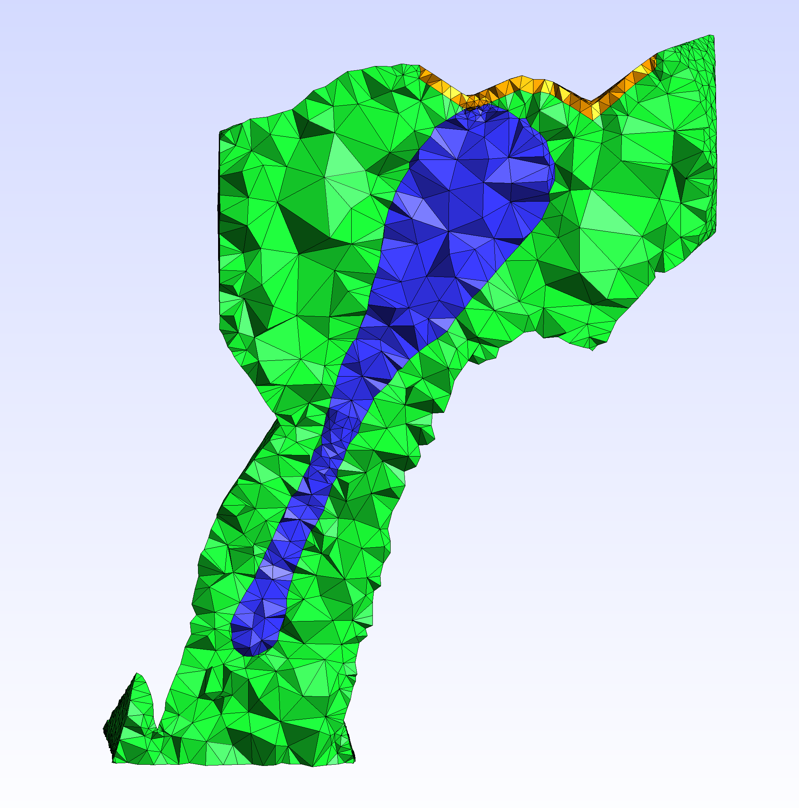
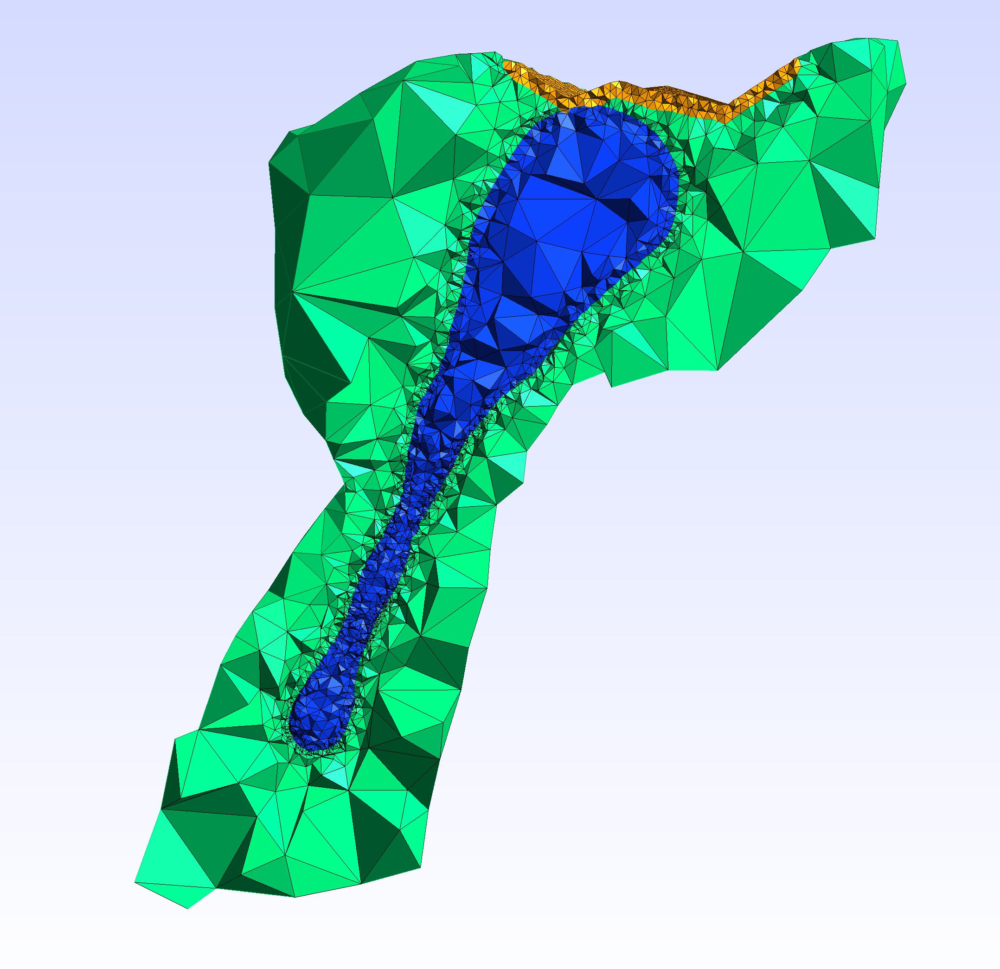

# MultiCompMesher

This program utilizes and extends [CGAL 3D mesh generation functionality](https://doc.cgal.org/latest/Mesh_3/index.html) to
generate an element-labeled multi-component tetrahedral mesh.


This program reads a list of watertight boundary surface meshes,
and a sign file describing the spatial relationship between each 
desired component and the boundary meshes, then generates a tetrahedral mesh with each component labeled separately according to the boundaries
and the component signs.

This program can not generate a tetrahedral mesh from `.swc` morphology data commonly
acquired from Light Microscopic (LM) imaging. For this purpose please visit [https://github.com/CNS-OIST/SWCTetMesher](https://github.com/CNS-OIST/SWCTetMesher).

# Prerequisite
* git
* a C++ compiler
* [CMake](https://cmake.org/) 
* [CGAL](https://www.cgal.org/) 
* [Boost](https://www.boost.org/) 

# Compilation
```
git clone https://github.com/CNS-OIST/MultiCompMesher.git
cd MultiCompMesher
mkdir build
cd build
cmake ..
make
```

# Usage
The commands below assume you are still in `MultiCompMesher/build`
    
* Basic usage
    ```
    ./MultiCompMesher BOUNDARY-FILE COMPONENT-FILE OUTPUT
    ```
    * BOUNDARY-FILE: a plain text file where each line stores
    the path to a boundary surface mesh file (in `.off|.obj|.stl|.ply|.ts|.vtp` format).  
    All lines starting with the `#` sign are considered as comments,
    and will be ignored by the program. Empty lines are also ignored.

    * COMPONENT-FILE: a plain text file where each line labels
    the relationship between each component and the boundaries
    using `+` (exclusive), `-` (inclusive) or `*` (ignored) signs.  
    For example,  assume that there are three boundaries, b1, b2 
    and b3. A component labeled `-++` means the tetrahedrons of the 
    component should be in b1, and should not be in b2 and b3. 
    A component labelled `+-*` means the tetrahedrons of the component 
    should not be in b1, should be in b2 and b3 is ignored (it could either
    be in or out of b3). The first component appears in the file will be
    labeled as component 1, and the rest will be labeled by incremental
    order. When a point could be in several components, it is attributed
    to the component with lowest identifier. All lines starting with the
    `#` sign are considered as comments, and will be ignored by the
    program. Empty lines are also ignored.

    * OUTPUT: Path to the output mesh file. The output mesh is in .mesh
    format, which can be opened and converted to other formats in 
    [Gmsh](http://gmsh.info/).

* Advance usage  
    * Mesh repairing
    
        If there is problem with one or more boundary meshes, such as orientation issue, 
        this program will try to repair the mesh and save the repaired version to another file. 
        The program will then use the repaired mesh in later steps to generate the tetrahedral mesh.

    * Mesh intersection detection

        The program will automatically detect any intersection between mesh boundaries, and will raise
        an error if intersection is found. This is required for maintaining manifoldness of the generated
        mesh (`--manifold 1` and `--manifold 2`, see Mainifoldness below). To skip the detection and continue the program as it is, add `--no-intersect-check` to the command.

    * Individual patch/component sizing control

        The `--size-field-file SIZING-FIELD-FILE` option accepts a `SIZING-FIELD-FILE` as input, 
        allowing individual configuration of patches and components over the global settings.
        This is particularly useful if the user wants to increase the fineness of a 
        specific patch/component without a dramatic increase of global element count.

        A `SIZING-FIELD-FILE` is a plain text file similar to [the example file](example/sizefields.txt)

        ```
        # patch between Cyto and ER
        patch 1 3 0.005 0.0001
        # component 2 (PSD)
        component 2 0.005
        ```

        Three types of inputs are accepted in the file:
        1. Comments and empty lines
            
            Lines starting with `#` are considered as comments and will be skipped in the process.
            Empty lines are also ignored.

        2. Patch setting

            ```
            patch COMPONENT-ID1 COMPONENT-ID2 PATCH-FC-SIZE PATCH-FC-DISTANCE
            ``` 
            The `COMPONENT-ID` is the order of appearance of components in the `COMPONENT-FILE`,
            note that 0 is the `COMPONENT-ID` for outer space, so `patch 0 1` defines the
            patch of surface boundary formed by component 1.

            `PATCH-FC-SIZE` and `PATCH-FC-DISTANCE` are the `fc-size` and `fc-distance` 
            configuration specific to this patch.

        3. Component setting

            ```
            component COMPONENT-ID COMPONENT-CC-SIZE
            ``` 
            The `COMPONENT-ID` is the order of appearance of components in the `COMPONENT-FILE`,
            note that 0 is the `COMPONENT-ID` for outer space, so `COMPONENT-ID` should always
            be positive.

            `COMPONENT-CC-SIZE` is the `cc-size` configuration specific to this component.
    
    * <a name="Mainifoldness">Mainifoldness</a>


Other parameters can be set to control the meshing process and optimize the mesh quality. 
You can list them using

```
./MultiCompMesher -h
```
The usage of these parameters can be found in the 
[CGAL 3D mesh generation manual](https://doc.cgal.org/latest/Mesh_3/index.html).

# Concurrency (Parallel) mode 
    
If [Intel's TBB library](https://software.intel.com/en-us/tbb) is installed and found, 
the program will try to use [concurrency mode](https://github.com/CGAL/cgal/wiki/Concurrency-in-CGAL) 
for meshing. Users can disable it and uses sequential mode instead by setting the `ACTIVATE_CONCURRENCY` flag during compilation

```
cmake -DACTIVATE_CONCURRENCY=OFF ..
```

# Example

This example generates a mesh modeling a dendritic spine, with three
labeled components, the spine cytosol (excluding the other two components), 
the Endoplasmic Reticulum (ER), and the Postsynaptic Density (PSD) region.

The [boundary file](example/boundaries.txt) stores the path to the three
boundary surfaces.  
1. [spine boundary](example/Spine.off)
2. [ER boundary](example/ER.off)
3. [PSD boundary](example/PSD.off)

The [component file](example/components.txt) defines three components.  
1. The spine cytosol excluding ER and PSD: `-++`
2. The ER: `--+`
3. The PSD: `-+-`

The command to generate the mesh is
```
# assumed still in MultiCompMesher/build

./MultiCompMesher ../example/boundaries.txt ../example/components.txt ../example/output --fc-size 0.01 --fc-distance 0.001 --cc-size 0.05 --odt --lloyd --perturb --exude
```
The mesh is written to [output.mesh](example/output.mesh), then visualized
in Gmsh. Note that each component is labeled and colored individually. To use the mesh in [STEPS](http://steps.sourceforge.net), the user needs to
export it to the Abaqus inp format or the Gmsh 2.0 ASCii format in Gmsh.


Using [these sizing settings](example/sizefields.txt), we can decrease the global resolution but increase the
resolution of the ER membrane, as well as the PSD region component, resulting in a geometry-adapted mesh.
```
./MultiCompMesher ../example/boundaries.txt ../example/components.txt ../example/sizing-output --fc-size 0.1 --fc-distance 0.01 --cc-size 0.1 --odt --lloyd --perturb --exude --size-field-file ../example/sizefields.txt 
```

